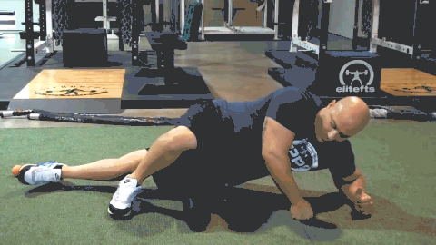

Foam Roll IT Band: 10-15 passes

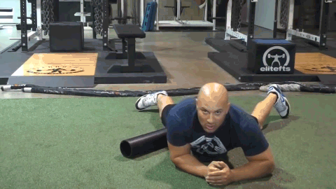

Foam Roll Adductors: 10-15 passes

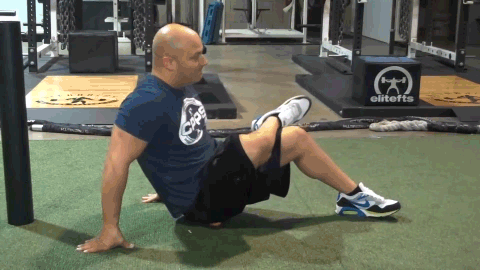

SMR Glutes (lax ball): 30sec. - 2min.

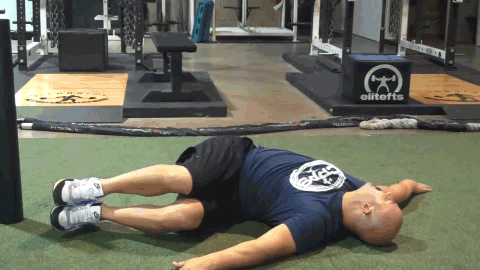

Bent-knee Iron Cross x 5-10 each side

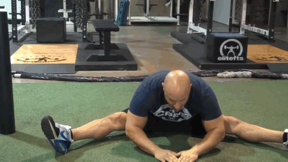

Roll-overs into V-sits x 10

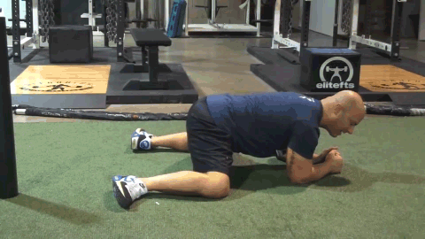

Rocking Frog Stretch x 10

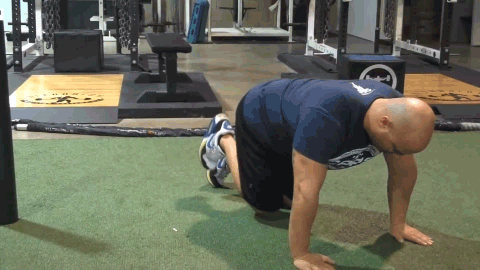

Fire Hydrant Circles x 10 fwd/10 bwd

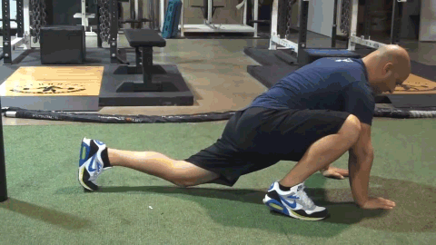

Mountain Climbers x 10 each leg

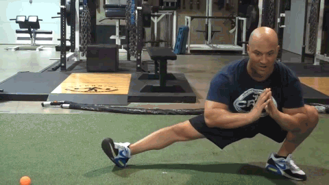

Cossack Squats x 5-10 each side

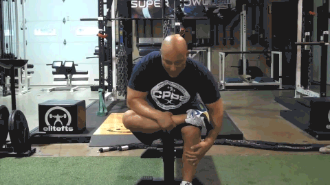

Seated Piriformis Stretch x 20-30sec. each side

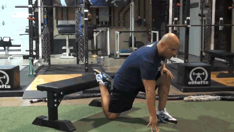

Rear-foot-elevated Hip Flexor Stretch x 5-10 reps (3sec. hold) each side
